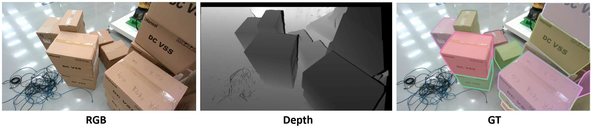

# Box-IS
RGB-D instance segmentation box dataset 



```
Train   : 488 images
Val     : 55 images
Classes : 1
Size    : 1280 × 720
```

## Data preparation

Box-IS : https://api.onedrive.com/v1.0/shares/u!aHR0cHM6Ly8xZHJ2Lm1zL3UvcyFBdFEycWtVUmI4dlFybFFwOWQ2a1VaQkxjbEhjP2U9Tkp4ajFv/root/content

```
Box-IS/
└── train2017/
└── val2017/
└── annotations/
    └── instances_train2017.json
    └── instances_val2017.json
└── train2017_depth/
└── val2017_depth/
```

## Data Format
```
annotation{
    "id": int,
    "image_id": int,
    "category_id": int,
    "segmentation": [polygon],
    "area": float,
    "bbox": [x,y,width,height],
    "iscrowd": 0 or 1,
}

categories[{
    "id": int,
    "name": str,
    "supercategory": str,
}]
```


